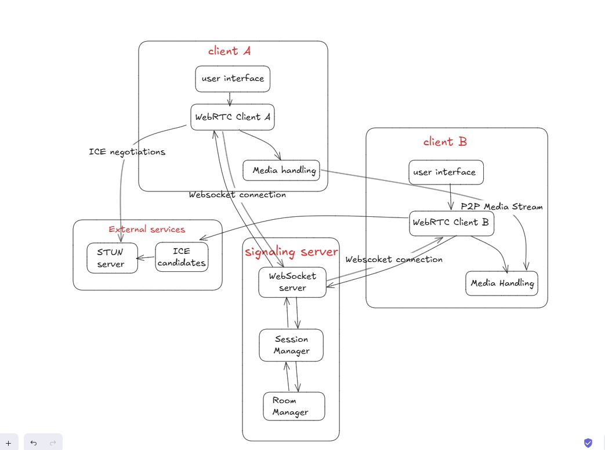

# WebRTC App - Software Development Life Cycle (SDLC)

## Scope of the Project

The WebRTC application focuses on facilitating interactive video communication with robust user control and recording capabilities. The project's core scope encompasses peer-to-peer session management, supporting two-participant sessions and multiple concurrent session creation. 

Key features include:
- User-controlled recording permissions, where one participant must obtain explicit consent from the other before initiating a recording.
- Real-time audio/video capture.
- Call management functionalities like muting.
- Prioritization of user privacy and collaboration through granular recording controls, ensuring both participants have agency in managing their communication sessions.

---

## Project Requirements List

- System supports two-participant video/audio communication.
- Recording functionality requires explicit user consent.
- Each session allows mute/unmute audio controls.
- Recording can be initiated by either participant.
- Participants can start and end calls.
- System manages multiple concurrent sessions.
- Peer-to-peer connection establishment protocol.
- Permission-based recording management.
- Error handling for connection disruptions.

---

## Functional Requirements

- Two-person video/audio calls.
- Unique room ID creation.
- Multiple session creation.
- Real-time interaction platform.
- User-controlled recording feature.
- Recording permission request.
- Consent-based recording mechanism.
- Start and end call functionality.
- Audio mute/unmute options.

---

## Environment

The application runs in the following browsers:
- Google Chrome
- Microsoft Edge
- OperaGX
- Firefox

---

## Technical Design / Illustration

---

## Test Plan/Test Cases

### Connection Testing

- Verify two users can successfully join a session.
- Verify attempts for a third user to join are properly rejected.
- Test session creation with valid and invalid session IDs.
- Verify multiple separate sessions can run concurrently.
- Test session behavior when one participant loses connection.
- Verify reconnection capabilities.
- Test session cleanup after both participants leave.

### Media Stream Testing

- Verify audio/video streams are properly initialized for both users.
- Test stream quality and performance under different network conditions.
- Verify proper stream closure when session ends.
- Test fallback behavior when camera/microphone permissions are denied.

### Recording Permission Flow

- Test recording request initiation from either participant.
- Verify recording permission prompt appears for the remote user.
- Test "Allow" recording response.
- Test "Deny" recording response.
- Verify recording does not start if denied.
- Test timeout scenarios for permission requests.
- Verify recording status is properly displayed to both users.

### Recording Operations

- Verify recording starts properly when permission is granted.
- Test recording quality and format.
- Verify recording captures both local and remote streams.
- Test recording stop functionality.
- Verify recording auto-stops when call ends.
- Test recording resume capabilities.
- Verify recording file saving and format.
- Test maximum recording duration limits if applicable.

### Mute/Unmute Functionality

- Test local audio mute/unmute.
- Verify mute status is correctly displayed to both users.
- Test mute/unmute during active recording.
- Verify audio stream properly resumes after unmute.
- Test rapid mute/unmute switching.
- Verify mute state persists through connection drops.

### User Interface Testing

- Verify all status indicators are accurate and updated in real-time.
- Test responsiveness of UI controls.
- Verify error messages are clear and helpful.
- Test accessibility of all controls.
- Verify proper display of connection status.
- Test UI under different screen sizes.

### Error Handling

- Test behavior when media devices are disconnected.
- Verify proper error messages for all failure scenarios.

---

## Test Results

All the above test cases and the environments have been tested and are working successfully.

---

## Limitations

- Users must participate in an existing session and cannot create a new session on their own.

---

## Learnings from this Project

- Understanding Real-time communication protocols (WebRTC).
- Signaling with WebSockets.
- NAT traversal and STUN servers.
- Managing concurrent sessions.

---
